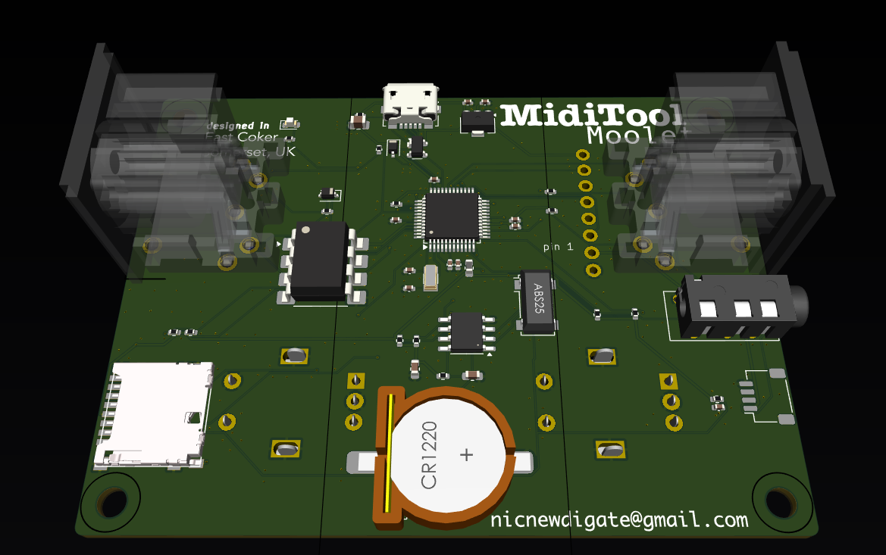

# samd21g-midi-tool
kicad design files for a general purpose midi dev board

* samdg21 arm cortex m0 microcontroller
* DIN-5 midi input and output
* st7735 display (128x128 16bit)
* realtime clock RTC
* socket for micro-SD card
* status LED
* SWD connection for programming
* PJ-320A connector for 2 foot-switches
* 5V POWER via USB
* 3V3 regulator
* 4-pin socket for neopixel strip D0
* Status LED D3   

## sources / credits:
  * schematics and pcb design based on [MKRZERO Arduino](https://docs.arduino.cc/hardware/mkr-zero/)   
  * 3d models:
    * [PJ320A PJ320D 3.5mm JACK](https://grabcad.com/library/pj320a-pj320d-3-5mm-jack-1)
    * [SMD CR1220 Battery case](https://grabcad.com/library/smd-cr1220-battery-case-1)
  * footprints
    * [PJ-320A](https://github.com/nathanhborger/PJ-320A_KiCad_Library)

## images

